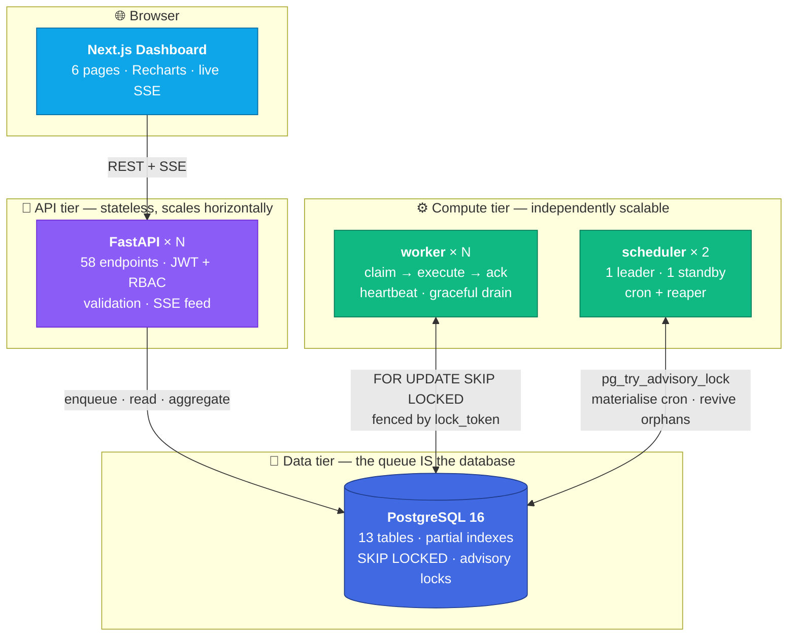
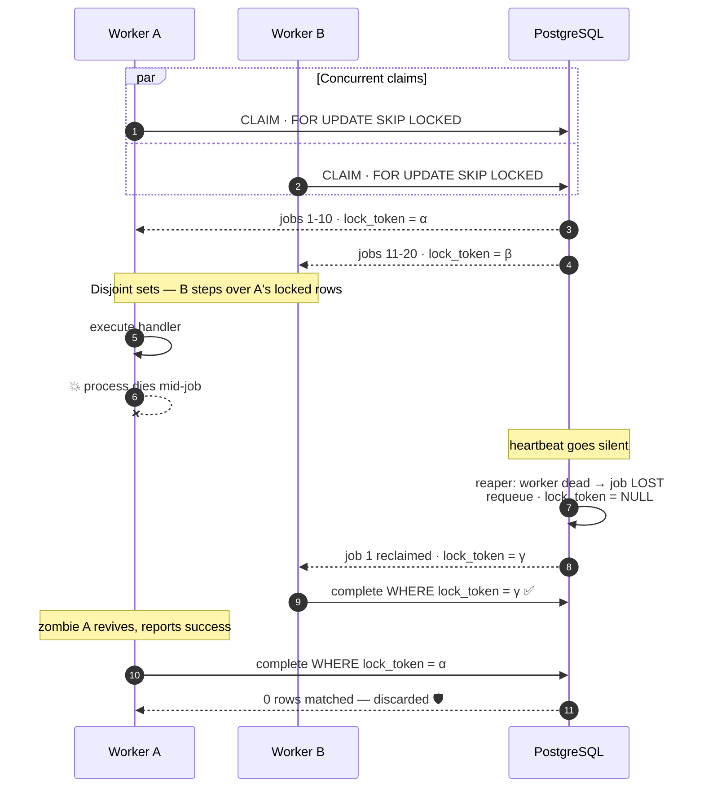
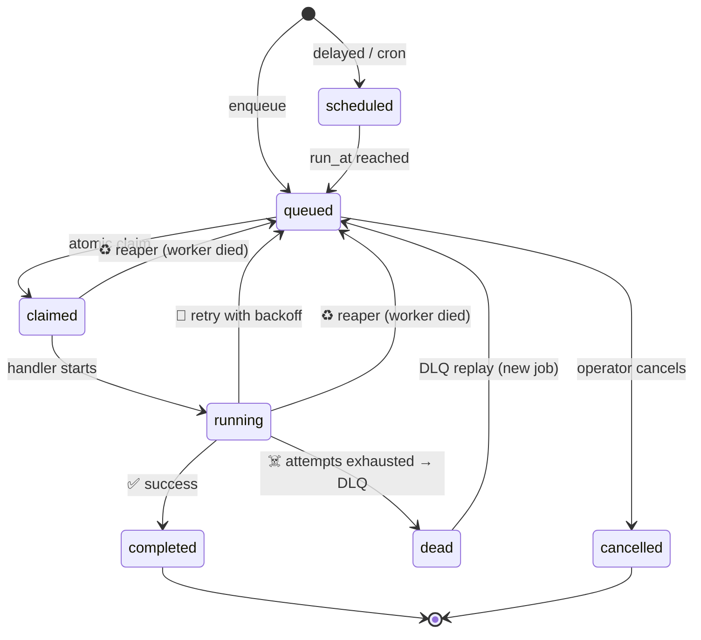

<div align="center">

# ⚡ Codity — Distributed Job Scheduler

**A production-inspired distributed job scheduler where PostgreSQL *is* the queue.**

Jobs are claimed atomically by a fleet of independent workers — with retry policies,
cron scheduling, crash recovery, dead-letter handling, and a live operator dashboard.

[](https://www.python.org/)
[](https://fastapi.tiangolo.com/)
[](https://www.postgresql.org/)
[](https://nextjs.org/)
[](https://www.docker.com/)
[](https://github.com/Shardul9999/Distributed-Job-Scheduler/actions/workflows/ci.yml)

</div>

> **The core guarantee:** with 10 workers competing for 500 jobs, every job runs
> **exactly once** — verified under `kill -9`. No queue library, no Redis, no broker.
> Just `FOR UPDATE SKIP LOCKED` and fencing tokens.

<div align="center">

| Highlight | |
|---|---|
| 🔒 **Exactly-once execution** | `SKIP LOCKED` claiming + `lock_token` fencing |
| ♻️ **Crash recovery** | heartbeats + reaper revive a dead worker's jobs |
| ⏰ **Cron scheduling** | IANA timezones, DST-safe, no double-fire |
| 👑 **Leader election** | `pg_try_advisory_lock`, no lease, no split-brain |
| 📊 **Live dashboard** | 6 pages, SSE streaming, throughput/latency charts |
| 🧪 **45 tests** | real PostgreSQL, no mocks — run on every push by [CI](.github/workflows/ci.yml) |

</div>

---

## Quick start

**Prerequisites:** Docker and Docker Compose. Nothing else — no local Python,
no local PostgreSQL.

```bash
cp .env.example .env
docker compose up -d
```

That is the whole setup. The API waits for PostgreSQL to become healthy, applies
all migrations, and starts serving.

| What | Where |
|---|---|
| **Dashboard** | http://localhost:3000 |
| API | http://localhost:8000 |
| Interactive API docs (Swagger) | http://localhost:8000/docs |
| Alternative docs (ReDoc) | http://localhost:8000/redoc |
| OpenAPI schema | http://localhost:8000/openapi.json |
| Liveness probe | http://localhost:8000/health |
| Readiness probe | http://localhost:8000/ready |

Verify it is running:

```bash
curl http://localhost:8000/health
```

---

## Try it

Register an account. This also creates your first organization and returns a
token pair in the same response.

```bash
curl -X POST http://localhost:8000/api/v1/auth/register \
  -H 'Content-Type: application/json' \
  -d '{
    "email": "you@example.com",
    "password": "choose-a-real-password",
    "full_name": "Your Name",
    "organization_name": "Acme Inc"
  }'
```

Save the `access_token` from the response, then create a project:

```bash
TOKEN="<paste access_token>"
ORG=$(curl -s http://localhost:8000/api/v1/orgs \
  -H "Authorization: Bearer $TOKEN" | python -c "import sys,json;print(json.load(sys.stdin)[0]['id'])")

curl -X POST "http://localhost:8000/api/v1/orgs/$ORG/projects" \
  -H "Authorization: Bearer $TOKEN" \
  -H 'Content-Type: application/json' \
  -d '{"name": "Email Pipeline", "description": "Transactional email jobs"}'
```

---

## Dashboard

The web dashboard at **http://localhost:3000** is the operator's view of the
whole system: throughput and latency charts, queue depth, the live worker fleet,
cron schedules, and the dead-letter queue — all updating live over Server-Sent
Events.

To see it populated, seed a demo tenant with queues, a cron schedule, and a
realistic job mix (fast successes, retries that recover, failures that
dead-letter):

```bash
python scripts/seed.py
```

The script uses only the Python standard library and talks to the API over
HTTP, so it needs no dependencies. It prints the demo login when it finishes:

| | |
|---|---|
| URL | http://localhost:3000 |
| Email | `demo@codity.dev` |
| Password | `demodemo123` |

Seven pages: **Overview** (live metrics + charts), **Queues** (depth, pause /
resume), **Job Explorer** (filter, keyset paging, per-job execution history and
logs, retry / cancel), **Workers** (fleet with heartbeat freshness),
**Schedules** (cron entries, next fire time, manual trigger), **Dead Letters**
(failure inspection and replay), and **Team** (roster, invite by email, change
role, remove).

**Roles are visible, not just enforced.** Your role in the current
organization shows in the sidebar, and every write control — pause, retry,
cancel, trigger, replay, discard — is disabled with a reason when your role is
below `member`. A viewer who sees a greyed-out *Retry* learns the action exists
and that their role withholds it; hiding it would just look like a bare page.
The client-side check is a courtesy: every one of those actions is refused again
server-side, which is what `tests/test_authorization.py` asserts.

Sign-up is self-service at **/register** — one call creates the account, its
organization, and a token pair, so a second account for testing roles takes
about fifteen seconds.

**Design language.** The dashboard deliberately mirrors Codity's own product
console: the surface, border, text, accent and status colours are Codity's design
tokens verbatim (`--bg-app` `#090909`, `--bg-surface` `#0d0d0d`, `--accent`
`#0075ff`, `--status-success` `#3ec98a`, …), set in **Archivo** with **JetBrains
Mono** for machine-written values — the same pairing Codity uses. Radii are kept
tight (3–6px) for the same reason theirs are: an operations console should read
as precise. Tokens live in one place, [`tailwind.config.ts`](apps/web/tailwind.config.ts).

Live updates use SSE rather than WebSockets — the feed is strictly
server→client, so `EventSource` (which reconnects natively) is the right tool.
Because `EventSource` cannot set an `Authorization` header, the `/events`
endpoint accepts the access token as a query parameter, validated exactly as the
header form is.

---

## Architecture

Four independently deployable process types share one PostgreSQL database:



**The queue is PostgreSQL itself**, not Redis or a message broker. Jobs are
claimed with a single atomic statement:

```sql
SELECT id FROM jobs
WHERE status IN ('queued','scheduled') AND run_at <= now()
ORDER BY priority DESC, run_at ASC
FOR UPDATE SKIP LOCKED
LIMIT :n
```

`SKIP LOCKED` makes competing workers step over rows another transaction already
holds, so N workers claim N disjoint batches with no contention and no blocking.
Full reasoning in [docs/DESIGN-DECISIONS.md](docs/DESIGN-DECISIONS.md).

### How exactly-once survives a concurrent fleet



The last two steps are the point: a revived zombie holds a **stale token**, so its
write matches zero rows. Recovery without fencing would just be a slower path to
running a job twice.

### Job lifecycle



Two failure paths, deliberately asymmetric: a **handler that raised** consumes a
retry and backs off; a **worker that vanished** also consumes the attempt, because
a lost job may have had side effects. A job *released* during graceful shutdown is
refunded — it never ran.

---

## Bonus features

The assignment listed eight; **three are implemented** and the other five are
deliberately scoped out with a recorded rationale — full table in
[docs/DESIGN-DECISIONS.md](docs/DESIGN-DECISIONS.md) §30–32.

| Bonus | Status |
|---|---|
| Distributed locking | **Built** |
| Role-based access control | **Built** |
| AI-generated failure summaries | **Built** |
| WebSocket live updates | Live updates **built via SSE** — chosen over WebSockets for a server→client-only feed |
| Event-driven execution | Polling with backoff; `LISTEN/NOTIFY` documented as the upgrade path |
| Workflow dependencies | Scoped out — `jobs.depends_on` reserved |
| Rate limiting | Scoped out — `queues.rate_limit_per_sec` reserved |
| Queue sharding | Scoped out — partial claim index keeps latency flat without it |

The three that are built:

- **Distributed locking** — the scheduler is a leader-elected singleton via
  `pg_try_advisory_lock` on a dedicated session-scoped connection. No lease, no
  TTL, no split-brain; a `kill -9` on the leader frees the lock automatically.
- **RBAC** — ranked roles (`viewer < member < admin < owner`) enforced by a
  FastAPI dependency that runs before the handler; non-members get `404`, not
  `403`, so org ids can't be enumerated.
- **AI failure summaries** — a dead-lettered job's stack trace is summarised into
  one plain-English cause on the DLQ page. **Optional and provider-agnostic:**
  set `GROQ_API_KEY` *or* `GEMINI_API_KEY` in `.env` to enable it (free tiers:
  [Groq](https://console.groq.com/keys), [Gemini](https://aistudio.google.com/apikey)).
  With no key set, the feature is inert — `ai_summary` stays null and the system
  behaves identically. Generated lazily on first inspection, then cached; any
  provider error degrades silently to no summary.

---

## Project layout

```
apps/
  api/            FastAPI service
    core/         config, security, deps, errors, logging, pagination
    routers/      one module per resource group
    schemas/      Pydantic request/response contracts
    services/     business logic (routers stay thin)
  worker/         claim loop, executor, handlers, heartbeat
  scheduler/      leader election, cron materialization, reaper
  web/            Next.js dashboard (frontend)
packages/
  db/             SQLAlchemy models, enums, session, Alembic migrations
tests/            pytest suite, incl. the 10-worker concurrency test
docs/             plan, architecture, ER diagram, design decisions
scripts/          container entrypoint, demo seed script
```

---

## Database

Thirteen tables:

| Concern | Tables |
|---|---|
| Identity & tenancy | `users`, `organizations`, `organization_members`, `projects` |
| Queue configuration | `retry_policies`, `queues` |
| Job data | `jobs`, `job_executions`, `job_logs`, `scheduled_jobs`, `dead_letter_queue` |
| Worker fleet | `workers`, `worker_heartbeats` |

Full schema rationale — keys, indexes, normalization, cascade policy — is in
[docs/PLAN.md](docs/PLAN.md) §4 and inline in
[packages/db/models.py](packages/db/models.py).

### Migrations

Applied automatically on API startup. To run them manually:

```bash
docker compose run --rm api alembic upgrade head
```

After changing a model, generate a migration:

```bash
docker compose run --rm api alembic revision --autogenerate -m "describe change"
```

Always read the generated file before committing it — autogenerate does not
detect every change, particularly enum value additions.

---

## Development

```bash
docker compose logs -f api        # follow API logs
docker compose restart api        # restart after a dependency change
docker compose down               # stop everything
docker compose down -v            # stop and DESTROY the database volume
```

Application code is bind-mounted, so edits reload automatically without a
rebuild. Rebuild only when `requirements.txt` changes:

```bash
docker compose build api
```

Open a database shell:

```bash
docker exec -it codity-postgres psql -U codity -d codity
```

---

## Conventions

**Error envelope.** Every error response, without exception, has this shape:

```json
{
  "error": {
    "code": "NOT_FOUND",
    "message": "Project not found",
    "details": null,
    "request_id": "5d27798409d74581a6d78df78b10a39b"
  }
}
```

`request_id` is also returned in the `X-Request-ID` header and stamped on every
server log line for that request, so any user-visible failure can be traced to
its logs.

**Pagination** is keyset, not offset: `?cursor=<opaque>&limit=50`. Cost stays
constant regardless of depth, and rows are never skipped or duplicated when the
underlying table is being written to concurrently.

**Authentication** is JWT bearer, with separate access (30 min) and refresh
(7 day) tokens distinguished by a `type` claim that is verified on decode.

---

## Documentation

| Document | Contents |
|---|---|
| [docs/ARCHITECTURE.md](docs/ARCHITECTURE.md) | Four process types, module layering, job lifecycle, reliability guarantees |
| [docs/ER-DIAGRAM.md](docs/ER-DIAGRAM.md) | 13-table ER diagram, FK cascade policy, indexes, enums |
| [docs/DESIGN-DECISIONS.md](docs/DESIGN-DECISIONS.md) | 32 decisions with rejected alternatives and rationale |
| [docs/API.md](docs/API.md) | Endpoint reference — 58 operations |
| [docs/openapi.json](docs/openapi.json) | Machine-readable OpenAPI spec (also live at `/docs`) |
| [docs/PLAN.md](docs/PLAN.md) | Full implementation plan, schema, build schedule |

---

## Status

| Day | Scope | State |
|---|---|---|
| 0 | Scaffold, 13-table schema, migrations, auth, orgs, projects | **Done** |
| 1 | Queue + job APIs, atomic claim query, worker service | **Done** |
| 2 | Retries, DLQ, cron scheduler, reaper, concurrency tests | **Done** |
| 3 | Dashboard, SSE live updates, charts, metrics endpoints | **Done** |
| 4 | Diagrams, design decisions, API docs, bonuses (RBAC · distributed lock · AI summaries) | **Done** |
| — | Post-build hardening: fleet-wide concurrency cap, project/queue/policy-scoped role enforcement, role-administration rules, Team + sign-up screens | **Done** |
