# Entity–Relationship Diagram

Thirteen tables, generated by a single Alembic migration and verified against
the running database. The diagram is grouped into the four concerns it models:
**identity & tenancy**, **queue configuration**, **the job tables** (the hot
path), and **the worker fleet** (observability).

Types below are the PostgreSQL types actually created. `USER-DEFINED` columns are
native `ENUM`s (listed at the end), not `VARCHAR` with a `CHECK`.

```mermaid
erDiagram
    users ||--o{ organization_members : "is"
    organizations ||--o{ organization_members : "has"
    organizations ||--o{ projects : "owns"
    projects ||--o{ retry_policies : "defines"
    projects ||--o{ queues : "contains"
    projects ||--o{ workers : "registers"
    retry_policies ||--o{ queues : "governs"
    queues ||--o{ jobs : "holds"
    queues ||--o{ scheduled_jobs : "templates"
    queues ||--o{ dead_letter_queue : "collects"
    scheduled_jobs ||--o{ jobs : "materialises"
    jobs ||--o{ job_executions : "records"
    jobs ||--o{ job_logs : "emits"
    jobs ||--o{ dead_letter_queue : "dies into"
    jobs ||--o| dead_letter_queue : "replayed as"
    job_executions ||--o{ job_logs : "scopes"
    workers ||--o{ job_executions : "runs"
    workers ||--o{ worker_heartbeats : "beats"
    workers ||--o{ jobs : "claims"

    users {
        uuid id PK
        varchar email UK
        varchar password_hash
        varchar full_name
        boolean is_active
        timestamptz created_at
        timestamptz updated_at
    }
    organizations {
        uuid id PK
        varchar name
        varchar slug UK
    }
    organization_members {
        uuid org_id PK,FK
        uuid user_id PK,FK
        org_role role
    }
    projects {
        uuid id PK
        uuid org_id FK
        varchar name
        varchar slug
        text description
        varchar api_key_hash
    }
    retry_policies {
        uuid id PK
        uuid project_id FK
        varchar name
        retry_strategy strategy
        int max_attempts
        int base_delay_ms
        int max_delay_ms
        boolean jitter
    }
    queues {
        uuid id PK
        uuid project_id FK
        varchar name
        int priority
        int max_concurrency
        boolean is_paused
        int visibility_timeout_s
        int default_timeout_s
        int rate_limit_per_sec
        uuid retry_policy_id FK
    }
    jobs {
        uuid id PK
        uuid queue_id FK
        varchar job_type
        jsonb payload
        job_status status
        int priority
        int attempt
        int max_attempts
        int timeout_s
        timestamptz run_at
        timestamptz claimed_at
        timestamptz started_at
        timestamptz completed_at
        uuid claimed_by FK
        uuid lock_token
        varchar idempotency_key
        uuid batch_id
        uuid scheduled_job_id FK
        uuid_array depends_on
        text last_error
        jsonb result
    }
    job_executions {
        uuid id PK
        uuid job_id FK
        int attempt_number
        uuid worker_id FK
        execution_status status
        timestamptz started_at
        timestamptz finished_at
        int duration_ms
        text error_message
        text error_stack
        jsonb output
    }
    job_logs {
        bigint id PK
        uuid job_id FK
        uuid execution_id FK
        log_level level
        text message
        jsonb metadata
        timestamptz logged_at
    }
    scheduled_jobs {
        uuid id PK
        uuid queue_id FK
        varchar name
        varchar cron_expression
        varchar timezone
        varchar job_type
        jsonb payload
        boolean is_active
        timestamptz last_run_at
        timestamptz next_run_at
    }
    dead_letter_queue {
        uuid id PK
        uuid job_id FK
        uuid queue_id FK
        varchar job_type
        jsonb original_payload
        text failure_reason
        text error_stack
        int total_attempts
        timestamptz died_at
        timestamptz replayed_at
        uuid replayed_job_id FK
        text ai_summary
    }
    workers {
        uuid id PK
        uuid project_id FK
        varchar hostname
        int pid
        varchar version
        int concurrency
        varchar_array queue_names
        worker_status status
        bigint jobs_processed
        timestamptz started_at
        timestamptz last_heartbeat_at
        timestamptz stopped_at
    }
    worker_heartbeats {
        bigint id PK
        uuid worker_id FK
        timestamptz beat_at
        int active_jobs
        bigint jobs_processed
        int cpu_percent
        int memory_mb
    }
```

---

## Foreign-key cascade policy

The `ON DELETE` action on every FK is a deliberate choice, not a default. Three
rules, applied consistently:

| Rule | Meaning | Where |
|---|---|---|
| **CASCADE** | The child *belongs to* the parent and has no life without it. Deleting the parent deletes the child. | `organization_members → organizations/users`, `projects → organizations`, `retry_policies/queues/workers → projects`, `jobs/scheduled_jobs → queues`, `job_executions/job_logs/dead_letter_queue → jobs`, `worker_heartbeats → workers` |
| **RESTRICT** | The child *references shared config*. Deleting a still-referenced parent is a mistake and is refused. | `queues.retry_policy_id → retry_policies` — a policy in use by a queue cannot be deleted out from under it |
| **SET NULL** | The link is *observability, not ownership*. The child outlives the parent with a null pointer. | `jobs.claimed_by → workers`, `job_executions.worker_id → workers`, `jobs.scheduled_job_id → scheduled_jobs`, `dead_letter_queue.replayed_job_id → jobs` |

The `SET NULL` cases are the interesting ones. A `job_execution` is an immutable
historical record; when a worker row is eventually purged, the *fact that the
execution happened* must survive with `worker_id = NULL` rather than vanish with
the worker. Likewise a DLQ entry keeps its forensic value even after the job it
was replayed as is deleted.

---

## Indexes that earn marks

Beyond primary keys and the obvious unique constraints, the schema carries
**partial** and **composite** indexes sized to specific hot queries:

| Index | Table | Purpose |
|---|---|---|
| `idx_jobs_claim` | jobs | The claim query. Partial: `WHERE status IN ('queued','scheduled')`, ordered `(queue_id, priority DESC, run_at)`. **16 kB vs 344 kB** for the full-column equivalent on the same rows — the claim scan stays flat as completed history grows. |
| `idx_jobs_reaper` | jobs | Finds orphaned `claimed`/`running` jobs for crash recovery. |
| `idx_jobs_idempotency` | jobs | **Partial unique** on `idempotency_key`. Enforces exactly-once enqueue and backs the cron occurrence key `cron:<id>:<fire>`. |
| `idx_jobs_explorer` | jobs | Composite, backs the keyset-paginated Job Explorer with its filter set. |
| `idx_jobs_batch` / `idx_jobs_scheduled_parent` | jobs | Batch rollups and "jobs from this schedule". |
| `idx_exec_metrics` | job_executions | Backs `date_bin` throughput/latency aggregates. |
| `uq_executions_job_attempt` | job_executions | Unique `(job_id, attempt_number)` — a given attempt can be recorded once. |
| `idx_sched_due` | scheduled_jobs | The scheduler's "what is due now" scan. |
| `idx_workers_alive` | workers | **Partial** on `last_heartbeat_at WHERE status IN ('active','draining')` — the reaper's liveness sweep only ever looks at workers that could still be alive. |
| `idx_dlq_unreplayed` | dead_letter_queue | **Partial** `WHERE replayed_at IS NULL` — the dashboard's default "unresolved failures" view. |

> The claim-index predicate must stay in sync with `CLAIMABLE_STATUSES` in
> `packages/db/enums.py`. If they drift, the claim query silently falls back to a
> sequential scan. This is called out in `ARCHITECTURE.md` and the schema module.

---

## Native enum types

Modelled as PostgreSQL `ENUM`s rather than free-text with a `CHECK`, so an
invalid state is unrepresentable at the type level and the state machine is
documented in the catalog itself:

| Enum | Values |
|---|---|
| `job_status` | `queued, scheduled, claimed, running, completed, failed, dead, cancelled` |
| `execution_status` | `succeeded, failed, timeout, lost` |
| `worker_status` | `starting, active, draining, dead, stopped` |
| `org_role` | `owner, admin, member, viewer` |
| `retry_strategy` | `fixed, linear, exponential` |
| `log_level` | `debug, info, warning, error` |

`execution_status.lost` is the load-bearing one: it distinguishes a job that
*failed in application code* from one *reclaimed by the reaper* because its worker
died. See `DESIGN-DECISIONS.md §3`.
